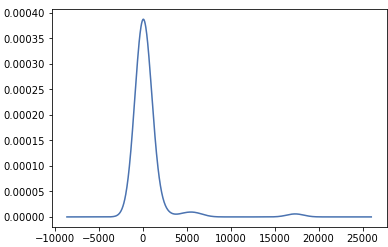
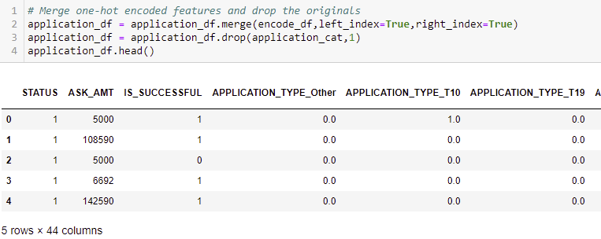
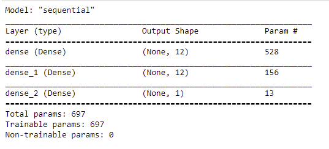

# Neural_Network_Charity_Analysis

#### Overview of the analysis: 

 Using knowledge of Neural Networks and machine learning, the team was tasked with utilising the the features within the dataset to help create a binary classifier to predict whether or not an applicant will be successful. There were a approximately 34,000 organizations that have recieved unding from the AlphabetSoup company and we are using that data to make our decisions.

#### Results: Using bulleted lists and images to support your answers, address the following questions.

**Data Preprocessing**
    * What variable(s) are considered the target(s) for your model? The variable that was considered the target of the model was the "IS_SUCCESSFUL".
    * What variable(s) are considered to be the features for your model? The features were 'APPLICATION_TYPE', 'CLASSIFICATION', 'USE_CASE', 'ORGANIZATION', 'STATUS', 'INCOME_AMT', 'SPECIAL_CONSIDERATIONS', and 'ASK_AMT'.
    * What variable(s) are neither targets nor features, and should be removed from the input data? The variables ythat were neither feature or target were 'EIN' and 'NAME'. Each of those columns had too many unique values and the values were irrelevant to determine the outcome. Both of those columns were removed from the data.
    * There were bins created to assist with making the data less noisy. Here you see that we used a Classicification column value count and an Application type value count used to create the plot.density plots.
  
 

    * The data was scaled using scikit learn
    * The data was then encoded and the model was trained.
 
 
  
**Compiling, Training, and Evaluating the Model**

    * How many neurons, layers, and activation functions did you select for your neural network model, and why? Initially I had 2 hidden layers, 8 and 5 neurons respectively,  and I used 'tanh' for the 1st layer and relu
    * Were you able to achieve the target model performance? I was not. On my initial run through(pre-optimization), I was able to make it to 72.xx%. When I reran it, it is now around 50% and I can't figure out what went wrong. My optimization file still shows the 72.xx%. There were multiple changes I made to get the accuracy higher, but all of my attempts were unsucessful.
    * What steps did you take to try and increase model performance? 
      *  Initially I added a 3rd hidden layer with 8 nodes, only a incremental change happened
      *  Changed the 1st hidden layer activation to 'tanh' from 'relu', small incremental increase
      *  Removed the 3rd layer, changed the nodes on hidden layers 1 and 2 to 12, and changed the activation back from 'tanh' to 'relu', small increase
  

#### Summary: 

* The overall results the optimization attempts were somewhat successful but not up to the 75% that was needed. 
