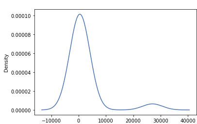
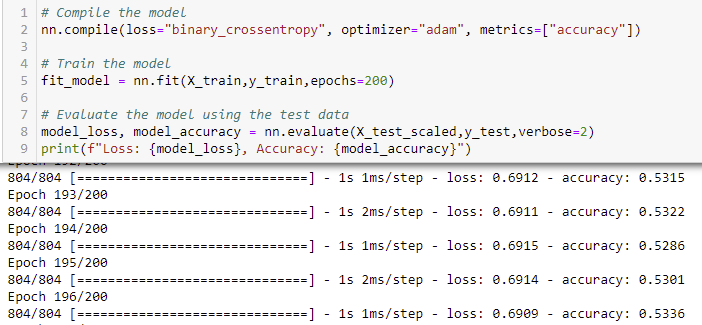

# Neural_Network_Charity_Analysis

## Overview of the analysis: 

 Using knowledge of Neural Networks and machine learning, the team was tasked with utilizing the features within the dataset to help create a binary classifier to predict whether an applicant will be successful. There were an approximately 34,000 organizations that have received funding from the AlphabetSoup company and we are using that data to make our decisions.

## Results: 

### **Data Preprocessing**

After examining the data, I was able to establish that the variable that was considered the target of the model was "IS_SUCCESSFUL". The features variables were: 'APPLICATION_TYPE', 'CLASSIFICATION', 'USE_CASE', 'ORGANIZATION', 'STATUS', 'INCOME_AMT', 'SPECIAL_CONSIDERATIONS', and 'ASK_AMT'. The variables that were neither feature nor target were 'EIN' and 'NAME'. Each of those columns had too many unique values and the values were irrelevant to determine the outcome. Both of those columns were removed from the data. There were bins created to assist with making the data less noisy. Here you see that we used a Classification column value count and an Application type value count used to create the plot.density plots.
  
 
    * The data was scaled using scikit learn.
    * The data was then encoded, and the model was trained.
 
 
  
### **Compiling, Training, and Evaluating the Model**
Initially I had 2 hidden layers with 8 and 5 neurons respectively, I used 'tanh' for the 1st layer and 'relu' for the second and used 'sigmoid' for the output. It is recommended that the second layer be slightly more complicated than the 1st and when you are looking for a binary output, sigmoid is best for that situation. I was not to achieve the model target of 75%. On my initial run through(pre-optimization), I was able to make it to 72.xx%. When I reran it, it is now around 50% and I cannot figure out what went wrong. My optimization file still shows the 72.xx%. There were multiple changes I made to get the accuracy higher, but all my attempts were unsuccessful.

* Steps I took to increase the model performance: 

      *  Initially I added a 3rd hidden layer with 8 nodes, only an incremental change happened.

      *  Changed the 1st hidden layer activation to 'tanh' from 'relu', small incremental increase.

      *  Removed the 3rd layer, changed the nodes on hidden layers 1 and 2 to 12, and changed the activation back from 'tanh' to 'relu', small increase.
  

### Summary: 

The overall results the optimization attempts were not successful. My initial neural network had a score of 72.XX% right out of the gate. After 3 attempts was not able to optimize the model for the desired output. Given more time I would like to add more layers and do additional research on different activation layers to see what would best fit the data.

Because we are in situation of binary classification, we could possibly use a Support Vector Machine (SVM) such as Random Forest Classifier to combine a few decision trees to generate a binary output and evaluate it against out deep learning model.
